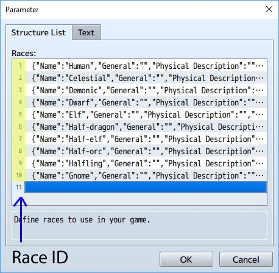

# Race Core v2.0.0

## Introduction

RPG Maker MV doesn’t have official support for races like other games such as Dungeons & Dragons and Pathfinder RPG.  Well, I’m here to fix that.  Races have been a part of RPGs since the beginning and a good solid core is needed to not only create this feature but to extend its capabilities in the future.  Version 2.0 adds some nice functionality to the plugin that allows it to be useful on its own while still working with the other plugins I made to extend functionality.  A Class template can be assigned to each race to customize your actors with stat adjustments, Traits and bonus Skills.

## How to Use

Just install the plugin and fill in the plugin parameters.  If you also install Yanfly’s Core Engine and Status Menu Core, you’ll more easily be able to see the adjustments to stats, elemental resistances and weaknesses and all of the extra attributes each character has.

This plugin is designed to be the core of various extension plugins that enable extra functionality for your game's races.  Those extensions will ask for a Race ID to identify the race you are adding parameters for.  The Race ID is the index of the entry in this plugin associated with the race in question.  You can find it here.

## Parameters

This is a plugin for races so, of course, you’ll need a parameter to define them for your game.  At the moment, the Name and Class ID are really all you need to define.  I have plans to incorporate the rest of the information in one or more other plugins but I can’t say for sure when those will be completed.

**Races** 
* **Name** - The name of a race.
* **Class Id** - Class template this race inherits.  These work a lot like assigning a second Class to an Actor.  They gain all of the Traits assigned and gain Skills at the indicated level.  Parameters like Attack, Defense etc can also add to the Actor but you have to define a baseline number to represent a zero adjustment.  This was done so that you can define penalties as well as bonuses to your racial stats.
* **General** - General description about this race.  This will be used as sort of an intro blurb.
Physical Description - Physical description about this race.  This should describe the physical characteristics of a typical member of this race.
* **Society** - Information about how this race typically interacts with other races.
* **Alignment and Religion** - Moral and religious information of the typical member of this race.  This describes which gods or religions this race typically follows and what they general alignment usually is.  Individual members of this race obviously can vary from the norm.
* **Adventurers** - Information about how and why members of this race become adventurers.

**Actor Config**
* **Description** - Description so you know what this entry is. Recommended but not required.
* **Actor Id** - Actor that these properties apply to.
* **Initial Race** - Name of the race that this actor starts as.

**Param Baseline** - Baseline value that equals zero change to stats.  Some races are stronger than others.  Some are weaker.  Some are faster.  The default value is set to 100.  What this means is that any param value that equals 100 will make no racial adjustment for that stat.  A value of 120 defined from levels 1-99 would always grant a static +20 bonus to the corresponding stat.  A value of 80 defined from levels 1-99 would always grant a static -20 penalty to the corresponding stat.  You can also define a curve that slopes up or down for a gradually increasing bonus or penalty as the Actor advances in level.  The plugin code is just subtracting the number you provide here from the race’s Class template’s defined params to generate a bonus or penalty.

**Adjust Parameters** - This is just a quick on/off switch for racial parameter adjustments.  Working with RPG Maker’s Class parameter curves can be annoying and cumbersome.  Often times, it’s just much easier to grant races Traits that work in percentages.  Assigning a Half-Giant a racial Trait to Attack of 125% and a racial Trait to Speed of 75% is just plain easier and might be exactly what you want.  I wanted to give you an easy way to just shut this off if you aren’t using it so that you don’t have to mess with the params if you’re not using this feature.

**Save Races Object** - Setting this to true allows you to modify the $dataRaces object, which contains all of the information within the plugin parameters, when the player saves the game.  By default, this object is built from the plugin parameters when a new game is started or a saved game is loaded.  This is usually what you’ll want.  If, for some reason, you need need to alter this data in-game and have those changes persist until the end of the game, you’ll need to turn this option on.

## Script and Plugin Commands

These commands will allow you to assign races to actors and to retrieve information about the actor’s race.

*Script Commands to get and set a race*
* FROG.Races.getRace(actorId);
* FROG.Races.getId(actorId);
* FROG.Races.getName(actorId);
* FROG.Races.getGeneral(actorId);
* FROG.Races.getSociety(actorId);
* FROG.Races.getReligion(actorId);
* FROG.Races.getAdventurers(actorId);
* FROG.Races.setRace(actorId, raceId);

*Plugin Commands to get and set a race (Don't include the brackets)*
The Type is piece of information that you want to retrieve.  This can be ID, NAME, GENERAL, SOCIETY, RELIGION or ADVENTURERS
* GETRACE [type] [actorId] [variableId]
* SETRACE [actorId] [race]

Examples

Get the Race ID of Actor 1 and store it in variable 5
* GETRACE ID 1 5

Get the Race name of Actor 4 and store it in variable 12
* GETRACE NAME 4 12

Store the Actor’s ID in variable 6 and then store the race name in variable 7.  All parameters can utilize the v[x] variable reference notation.
* GETRACE NAME v[6] 7

## Terms of Use

This plugin can be used in commercial or non-commercial projects.  You also have my permission to write and share plugins that add to or extend the functionality of this plugin.

Credit Frogboy in your work.

## Changelog
* Version 1.0 - Initial release
* Version 2.0.0 - Added Class templates and allow Actors to start with a race.
